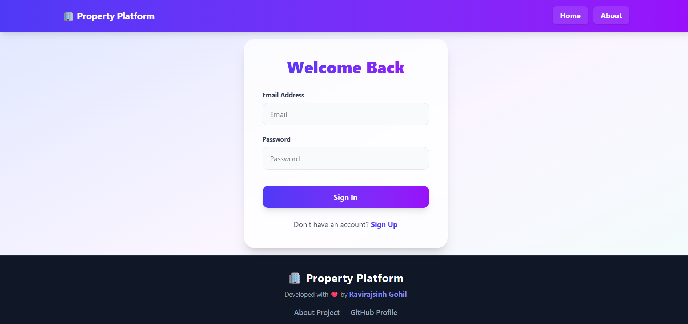
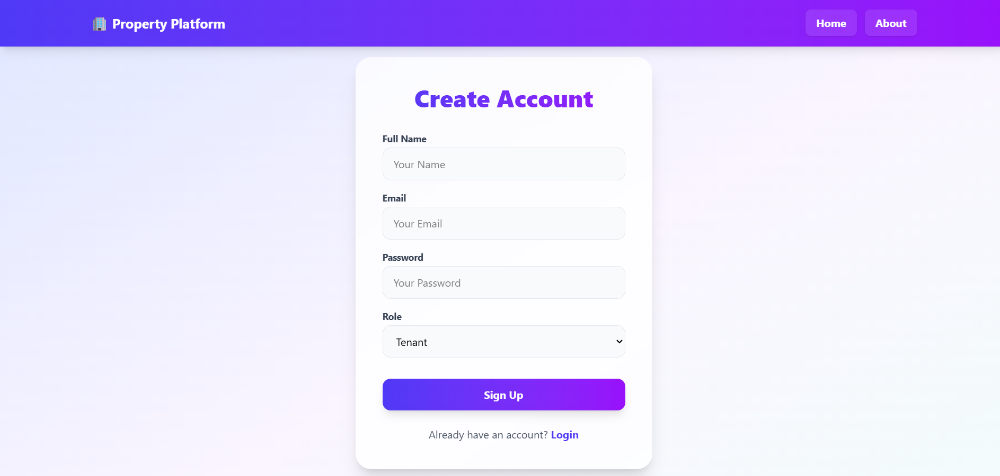
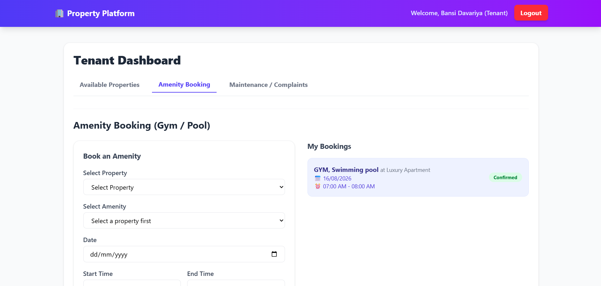
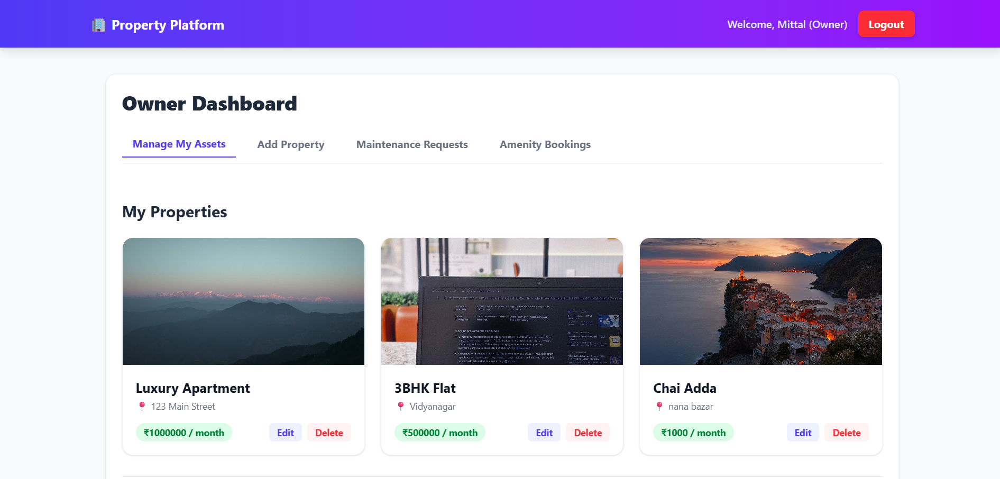
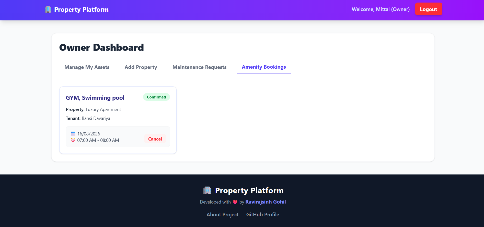
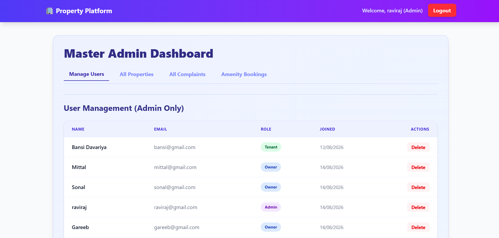
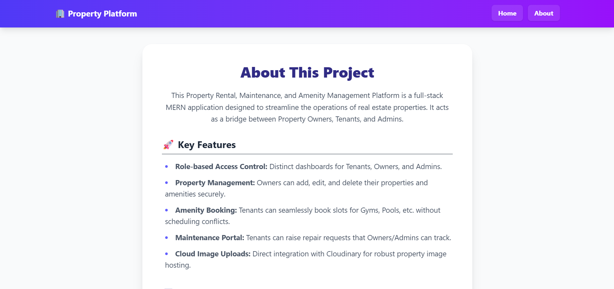

# 🏢 Property Rental, Maintenance & Amenity Management Platform

A full-stack role-based Web Application built with the **MERN (MongoDB, Express, React, Node.js)** stack. This platform bridges the gap between Property Owners, Tenants, and System Admins by providing a centralized hub for managing properties, booking amenities, and handling maintenance requests.

---

## 🎥 Project Walkthrough & Experience
*[Watch the Project Feedback & Walkthrough Video Here](https://youtube.com/your-video-link)*

---

## 📸 Screenshots

1. **Login & Registration Page**
   
   

2. **Tenant Dashboard**
   
   

3. **Owner Dashboard**
   
   

4. **Master Admin Dashboard**
   

5. **About Page**
   

---

## 🚀 Key Features

### 👤 Role-Based Dashboards
- **Tenants:** Browse available properties, book amenities (Gym, Pool, etc.), and raise maintenance/complaint tickets.
- **Property Owners:** Add, edit, and delete properties. Manage amenities, view maintenance requests for their properties, and oversee amenity bookings.
- **Master Admin:** Full system control. Manage users (View/Delete), view all properties across the system, oversee all complaints, and monitor all amenity bookings.

### 🏠 Property & Amenity Management
- **Add Properties:** Owners can easily list properties along with descriptions, rent details, and comma-separated amenities.
- **Dynamic Amenities:** Amenities are auto-generated when a property is listed and can be independently managed (deleted/updated) from the Owner's dashboard.
- **Interactive UI:** Users can view properties via a responsive, scrollable modal that includes direct action buttons (like "Book Amenity").

### 📅 Booking & Maintenance
- **Conflict-Free Booking:** Tenants can book amenities for specific dates and time slots. The system prevents double-booking and overlaps.
- **Maintenance Portal:** Tenants can raise tickets for repairs. Owners and Admins can view these requests to take action.

### ☁️ Secure Image Uploads
- Integrated with **Cloudinary** using **Multer**. 
- Supports standard web images and handles modern mobile formats like iPhone's `.heic` and `.heif` via conversion.

---

## 💻 Tech Stack

### Frontend
- **React.js** (Vite)
- **Tailwind CSS** (for responsive, modern UI)
- **React Router DOM** (for navigation)
- **Axios** (for API communication)

### Backend
- **Node.js & Express.js**
- **MongoDB & Mongoose** (Database and ODM)
- **JWT (JSON Web Tokens)** & **Bcrypt.js** (Authentication & Security)
- **Multer & Cloudinary** (Image processing and cloud storage)

---

## 🛠️ Local Setup Instructions

1. **Clone the repository:**
   ```bash
   git clone https://github.com/GohilRavirajsinh/Property-Rental-Maintenance-Amenity-Management-Plateform.git
   cd Property-Rental-Maintenance-Amenity-Management-Plateform
   ```

2. **Setup the Backend:**
   - Navigate to the server folder: `cd server`
   - Install dependencies: `npm install`
   - Create a `.env` file in the `server` folder with the following credentials:
     ```env
     PORT=5000
     MONGO_URI=your_mongodb_connection_string
     JWT_SECRET=your_jwt_secret_key
     CLOUDINARY_CLOUD_NAME=your_cloudinary_name
     CLOUDINARY_API_KEY=your_cloudinary_api_key
     CLOUDINARY_API_SECRET=your_cloudinary_api_secret
     ```
   - Start the backend: `npm run dev`

3. **Setup the Frontend:**
   - Open a new terminal and navigate to the client folder: `cd client`
   - Install dependencies: `npm install`
   - Create a `.env` file in the `client` folder:
     ```env
     VITE_API_URL=http://localhost:5000
     ```
   - Start the frontend: `npm run dev`

---

## 👨‍💻 About Developer

Developed with ❤️ by **Ravirajsinh Gohil**. 
This project was built to demonstrate proficiency in Full-Stack development, RESTful APIs, database schema design, and modern React UI/UX practices.
